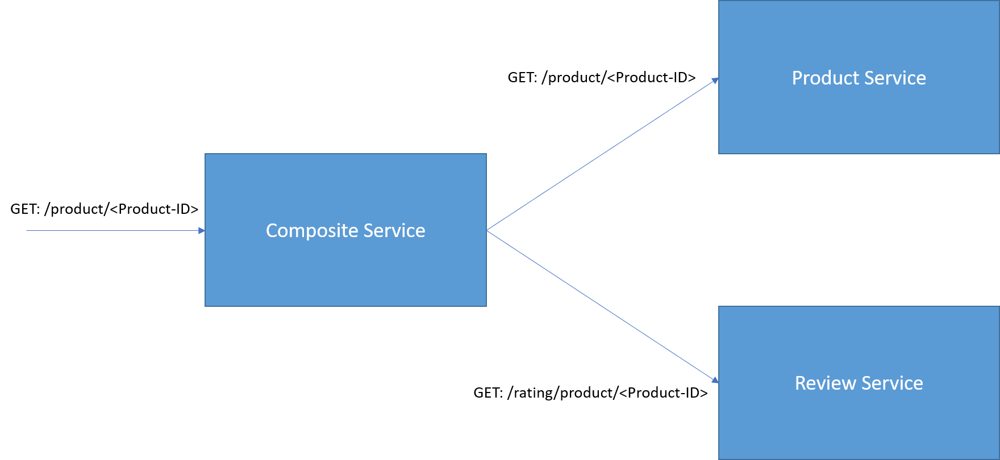

# Reference App

This is a simple reference application, implemented in Spring boot. These applications are Dockerised using Jib. Jib is included within maven.

This app has 3 services:

- Product Service : Provides details about the product.
- Rating Service: Provides rating for the chosen product
- Composite Service: This is an aggregator microservice, which combines the results of other 2 services.

# Design

The high level architecture of this application is as follows:

<< INSERT DIAGRAM >>

- All 3 services are implemented in Spring Boot 2.
- Product service and Rating service are using in-memory H2 database. The data scripts are in the resources folder. (Note: data.sql is automatically picked up by Spring JPA and loaded to DB)
- Only read operations are enabled in all 3 services.
